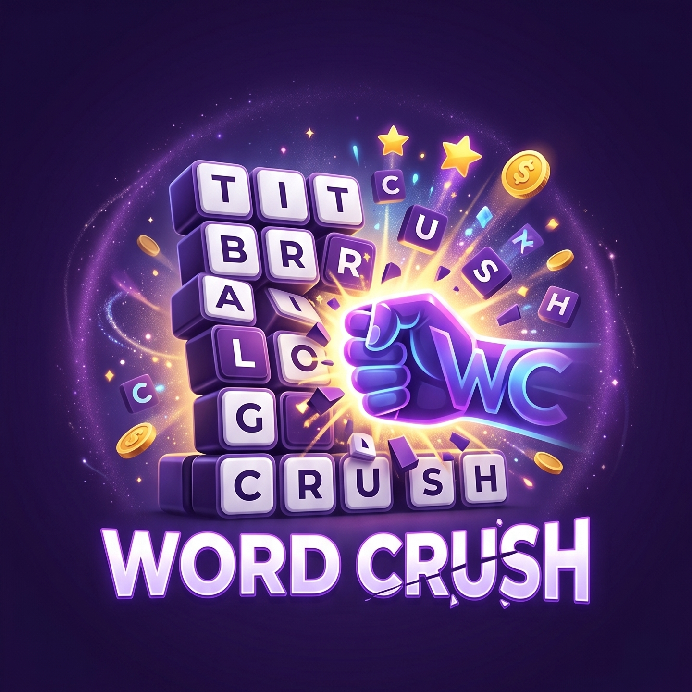

<div align="center">
  
  
  # Word Crush Mobil Oyunu
  
  **Kocaeli Üniversitesi Bilgisayar Mühendisliği - Yazılım Laboratuvarı-II Projesi**
</div>

Word Crush, Flutter kullanılarak geliştirilmiş, oyuncuların harfleri birleştirerek anlamlı Türkçe kelimeler oluşturduğu ve stratejik düşünme yeteneklerini test ettiği iki boyutlu (2D) mobil bir kelime oyunudur.

## 📌 Proje Hakkında

Oyuncular, 6x6, 8x8 veya 10x10 boyutlarındaki harf ızgaralarında (grid) parmaklarını sürükleyerek komşu harfleri birleştirir ve en az 3 harfli anlamlı kelimeler bulmaya çalışırlar. Bulunan kelimeler patlar, üstteki harfler yerçekimi mantığıyla aşağı düşer ve boş kalan yerlere Türkçe harf kullanım sıklıklarına uygun yeni harfler gelir. Oyunun amacı, kısıtlı hamle sayısıyla en yüksek puanı toplamaktır.

## 🚀 Özellikler

- **Dinamik Zorluk Seviyeleri:** 6x6 (Zor - 15 hamle), 8x8 (Orta - 20 hamle), 10x10 (Kolay - 25 hamle).
- **Akıllı Harf Üretimi:** Türkçe dilinin harf frekanslarına (A, E, İ vb. yüksek; J, Ğ vb. düşük) göre rastgele ancak oynanabilirliği garanti eden harf ataması.
- **Skor Tablosu (Leaderboard):** Toplam oyun, en yüksek puan, en uzun kelime ve detaylı geçmiş oyun istatistikleri.
- **Market Sistemi:** Oyun içi altınlar kullanılarak satın alınabilen stratejik jokerler.
- **Modern ve Akıcı UI:** Cam efekti (glassmorphism), "Derin Uzay" teması, 3D ızgara ve gelişmiş animasyonlar.

## 🌟 Özel Güçler ve Jokerler

Uzun kelimeler bulmak oyunculara özel güçler kazandırır:
- **4 Harf (Satır Temizleme):** Bulunduğu satırı tamamen temizler.
- **5 Harf (Alan Patlatma):** Çevresindeki komşu harfleri yok eder.
- **6 Harf (Sütun Temizleme):** Bulunduğu sütunu tamamen temizler.
- **7+ Harf (Mega Patlatma):** 2 birimlik çevredeki tüm harfleri yok eder.

### Market Jokerleri
Marketten altınla alınabilen ekstra jokerler:
- 🐟 **Balık:** Rastgele harfleri yok eder.
- 🎡 **Tekerlek:** Seçilen harfin satır ve sütunundaki her şeyi siler.
- 🍭 **Lolipop Kırıcı:** Tek bir harfi hedef alıp patlatır.
- 🔄 **Serbest Değiştirme:** Yan yana iki harfin yerini değiştirir.
- 🔀 **Harf Karıştırma:** Tüm gridi rastgele yeniden dizer.
- 🎉 **Parti Güçlendiricisi:** Tüm gridi sıfırlayıp baştan oluşturur.

## 🏆 Combo Mekaniği (Alt Kelimeler)

Oluşturduğunuz ana kelimenin içerisinde başka anlamlı kelimeler (en az 3 harfli) varsa, sistem bunu algılar ve Combo Puanı ekler!
Örneğin; **"SARI"** kelimesini bulduğunuzda sadece SARI için değil, içindeki **"ARI"** kelimesi için de ekstra puan ve combo çarpanı kazanırsınız.

## 🛠️ Kurulum ve Çalıştırma

Proje **Flutter** ile geliştirilmiştir. Oyunu bilgisayarınızda veya emülatörünüzde çalıştırmak için aşağıdaki adımları izleyin:

1. Depoyu bilgisayarınıza indirin:
   ```bash
   git clone https://github.com/aliiklnc/Word_Crush.git
   ```
2. Proje dizinine girin:
   ```bash
   cd Word_Crush/word_crush
   ```
3. Gerekli paketleri indirin:
   ```bash
   flutter pub get
   ```
4. Uygulamayı çalıştırın:
   ```bash
   flutter run
   ```

## 👨‍💻 Geliştirici
- **Ali Kılınç** - Kocaeli Üniversitesi Bilgisayar Mühendisliği
- **Sadık Gölpek** - Kocaeli Üniversitesi Bilgisayar Mühendisliği
